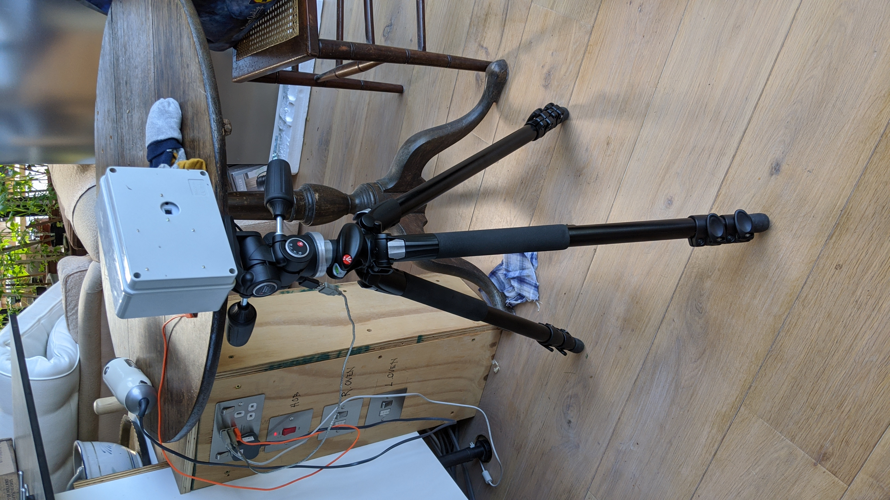
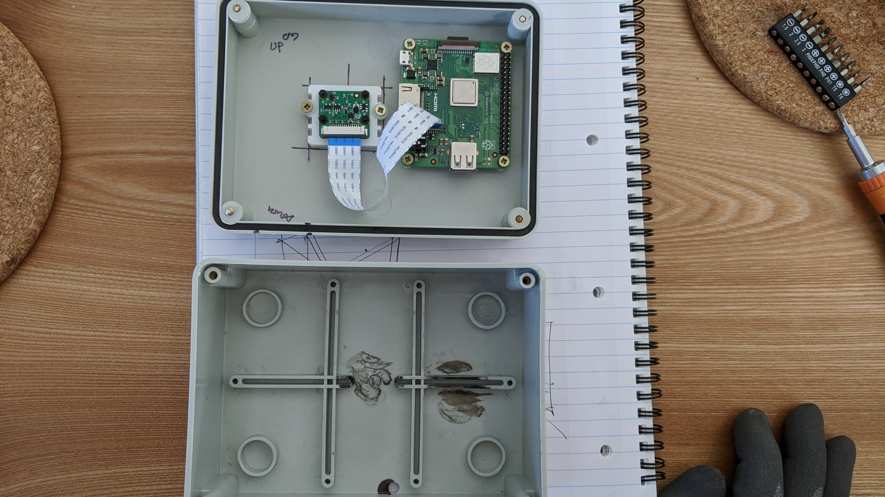
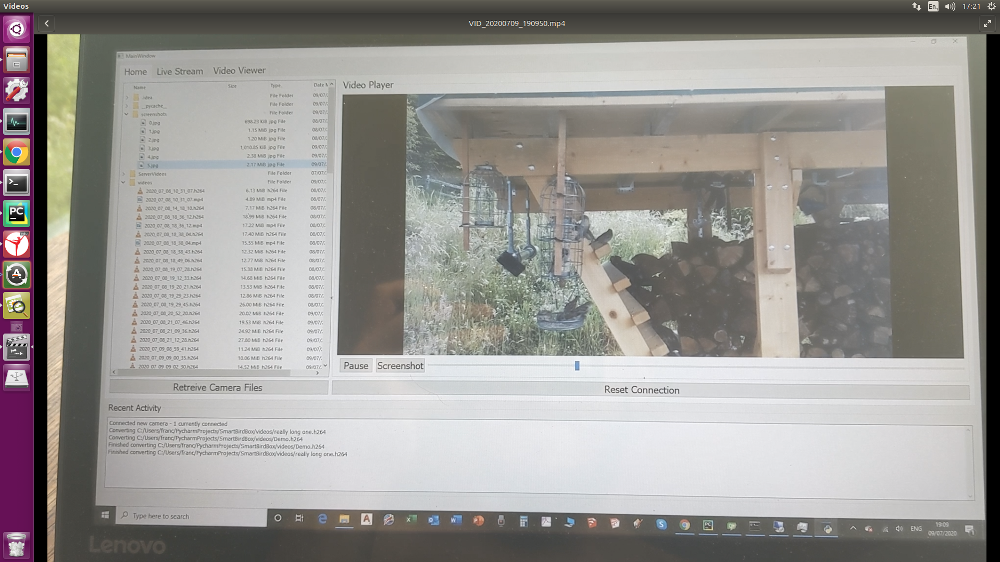

# BirdPi
This project uses a raspberry pi (any kind) to detect motion and subsequently record videos.  Using python's inbuilt socket library, the RPi connects to a server being any computer to transfer files.  This is run simultaneously using threading and multiprocessing so the video remains smooth while analysing RGB data.  This code can be used for any scenario that requires little human interference; however, this was initially used to record birds at a bird feeder.  This project was built on Rpi 3 A+ but i'm sure this would work on a zero decrease power consumption.

PyQt was used to create a user interface for the server side (any computer).  The user interface is used to download videos, livestream and change camera settings (exposure time, alpha gain, etc) to make life simple for anyone who's not familiar with programming.  Lastly, to allow the RPi to connect, the attribute "server names" in the file sender class must have the hostname of the computer which is running the user interface.  This is a list, so you can add multiple computers' hostnames.

  

